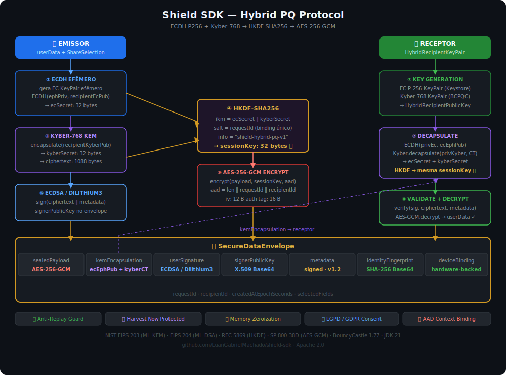

# Shield SDK

**Sistema Híbrido Independente de Envio Livre de Dados**

SDK Kotlin/JVM para compartilhamento seguro de dados com consentimento granular e proteção criptográfica de nível pós-quântico. Funciona em Android, Spring Boot, Ktor e qualquer JVM — sem dependência de servidor, sem infraestrutura obrigatória.




---

## Por que o Shield SDK existe

Compartilhar dados sensíveis entre sistemas hoje significa escolher entre conveniência e segurança. APIs REST expõem dados em trânsito a qualquer intermediário. Criptografia clássica ponto-a-ponto não resiste a computadores quânticos. Sistemas de consentimento vivem em camadas de aplicação, fora da criptografia.

O Shield resolve os três problemas ao mesmo tempo:

- **O dado nunca viaja em claro** — a criptografia acontece no dispositivo do usuário, antes de qualquer transmissão.
- **O receptor é o único que pode ler** — a chave de sessão é derivada via KEM pós-quântico, nunca existe como um valor transportado.
- **O consentimento faz parte da criptografia** — campos não autorizados são descartados antes de encriptar, não depois.

---

**Atualização do Shield SDK para segurança pós-quântica de nível 5 do NIST (Kyber-1024/Dilithium5)**

**Principais recursos implementados:**

- crypto/HybridPqKemService.kt: Atualização do Kyber-1024 para o Kyber-1024, atualização das informações do HKDF da v1 para a v2, proteção aprimorada contra downgrade com mensagens de erro detalhadas
- security/DilithiumSignatureService.kt: Atualizado de Dilithium5 para Dilithium5, atualizadas as especificações dos parâmetros e a documentação com novas tabelas de tamanho
- config/SDKConfig.kt: Atualizados os algoritmos de assinatura suportados para incluir dilithium5 em vez de Dilithium5 no conjunto de validação
- models/cipher/KemEncapsulation.kt: Alterado o kyberParameterSet padrão para kyber1024, atualizadas as mensagens de validação e os comentários de derivação do protocolo
- models/key/HybridRecipientPublicKey.kt: Ajustado o intervalo de validação do tamanho da chave pública do Kyber de 800-2000 para 1400-2200 para suporte ao Kyber-1024
- models/key/PQKeyDescriptor.kt: Atualizado o KDoc para refletir os parâmetros do Kyber-1024 (nível 5, ~AES-256) e o mapeamento de versão
- protocols/EnvelopeBuilder.kt: Atualizada a versão do protocolo para 2.0 e o kemAlgorithm para ECDH-P256+Kyber1024-HKDF-SHA256 nos metadados
- protocols/SnapshotFactory.kt: Atualizada a string kemAlgorithm para Kyber-1024 e ajustada a referência de versão do PQKeyDescriptor
- sdk/ShieldSDK.kt: Atualizada a resolução do serviço de assinatura para usar dilithium5, atualizadas as referências da documentação de Kyber-1024 para Kyber-1024
- build.gradle.kts: Aumentada a versão do artefato de 1.0.0 para 2.0.0 para refletir alterações significativas

**Esta atualização eleva a segurança do Shield SDK do Nível 3 do NIST (~AES-192) para o Nível 5 (~AES-256) por meio de algoritmos criptográficos pós-quânticos.** 

---

## Segurança

### Protocolo híbrido pós-quântico

O Shield usa um protocolo de duas camadas que resiste tanto a adversários clássicos quanto a futuros computadores quânticos.

**Camada de transporte da chave — ECDH-P256 + Kyber-1024 → HKDF-SHA256:**

```
ecSecret    = ECDH(ephemeral_P256_priv, receptor_ec_pub)     → 32 bytes
kyberSecret = Kyber1024.encapsulate(receptor_kyber_pub)       → 32 bytes
sessionKey  = HKDF-SHA256(ecSecret ‖ kyberSecret,
                           salt = requestId,
                           info = "shield-hybrid-pq-v1")     → 32 bytes
```

A chave final é comprometida somente se **ambos** os algoritmos forem quebrados simultaneamente. ECDH-P256 é vulnerável ao algoritmo de Shor em computador quântico. Kyber-1024 (NIST FIPS 203 / ML-KEM-1024) não é. A combinação garante proteção contra *harvest now, decrypt later* — onde um adversário captura dados hoje para decriptar quando tiver capacidade quântica.

**Camada de payload — AES-256-GCM ou ChaCha20-Poly1305:**

O payload é encriptado com a `sessionKey`. O AAD `requestId|recipientId` é passado para `Cipher.updateAAD()` — o GCM autentica o contexto junto com o ciphertext. Mover o ciphertext para outro envelope ou alterar o `recipientId` invalida a tag.

**Assinatura — ECDSA SHA256withECDSA (ou Dilithium5):**

Ciphertext + metadata sorted canonicamente é assinado com ECDSA. A chave pública do assinante viaja no envelope — verificação funciona offline, sem estado, em qualquer sessão. Dilithium5 (NIST FIPS 204 / ML-DSA-65) está disponível como alternativa totalmente pós-quântica para a assinatura.

### Garantias do envelope

| Propriedade | Mecanismo | O que detecta |
|---|---|---|
| **Confidencialidade** | AES-256-GCM / ChaCha20-Poly1305 | Leitura por terceiros |
| **Integridade do payload** | Tag GCM 128 bits | Qualquer alteração no ciphertext |
| **Binding de contexto** | AAD `requestId\|recipientId` | Envelope movido para outro receptor |
| **Autenticidade** | ECDSA sobre ciphertext + metadata | Forja de envelope |
| **Integridade do metadata** | Assinatura cobre metadata sorted | Adulteração de `expiresAt`, `legalBasis` |
| **Anti-replay** | `ReplayGuard` com janela de 1h | Reenvio do mesmo envelope |
| **Resistência quântica (KEM)** | Kyber-1024 + ECDH-P256 via HKDF | Adversário com computador quântico |
| **Resistência quântica (assinatura)** | Dilithium5 (opcional) | Forja via algoritmo de Shor |

### O que um atacante encontra

| Tentativa | Resultado |
|---|---|
| Interceptar o envelope | Ciphertext opaco — sem chave Kyber privada, a `sessionKey` não pode ser derivada |
| Alterar qualquer byte do ciphertext | `AEADBadTagException` — tag GCM inválida |
| Alterar `recipientId` | `AEADBadTagException` — AAD diferente do momento da criação |
| Alterar `expiresAt` no metadata | ECDSA inválida — metadata faz parte do material assinado |
| Reenviar o mesmo envelope | `SecurityException` — `ReplayGuard` registrou o `requestId` |
| Chave de decriptografia errada | `SecurityException` — checksum falha antes de tentar GCM |
| Par Kyber errado no decrypt | GCM falha — `sessionKey` diferente produz ciphertext indecifrável |

### Gerenciamento de memória

Materiais criptográficos são zerados imediatamente após o uso:

- `ecSecret.fill(0)` e `kyberSecret.fill(0)` em bloco `finally` — garantido mesmo em exceção
- `sessionKey.fill(0)` em `finally` no `decryptEnvelopePQ`
- `payloadBytes.fill(0)` após encriptar
- `decryptedBytes.fill(0)` após deserializar

---

## O Envelope

O `SecureDataEnvelope` é a unidade de troca. É um `data class` serializável — pode ser transmitido por HTTP, fila, Bluetooth, NFC, arquivo ou qualquer canal. Nenhum intermediário precisa entender sua estrutura para transportá-lo.

```
SecureDataEnvelope
├── requestId                      UUID único — salt do HKDF e do anti-replay
├── recipientId                    Identificador do receptor — parte do AAD
├── createdAtEpochSeconds          Timestamp único de criação (capturado uma vez)
├── identityKeyFingerprint         SHA-256 da chave pública ECDSA do emissor
├── deviceBindingFingerprint       SHA-256("device|" + identityFingerprint)
├── selectedFields                 Campos consentidos — verificados vs payload no decrypt
│
├── sealedPayload
│   ├── dataKeyVersion             Versão da chave (suporte a rotação)
│   ├── dataKeyChecksum            SHA-256(sessionKey)[0..8] — verificado antes do decrypt
│   ├── createdAt                  Mesmo valor de createdAtEpochSeconds
│   ├── associatedDataDigest       SHA-256(requestId|recipientId) — observabilidade
│   └── payload
│       ├── iv                     12 bytes aleatórios (SecureRandom por envelope)
│       └── ciphertext             AES-256-GCM(json, sessionKey, aad=requestId|recipientId)
│
├── userSignatureBase64            ECDSA(ciphertext ‖ "||" ‖ metadata_sorted)
├── signerPublicKeyBase64          Chave pública X.509 DER — verificação offline
│
├── encryptedDataKeyBase64         RSA-OAEP(sessionKey) — modo clássico (null no PQ)
│
├── kemEncapsulation               Materiais públicos do KEM — modo PQ
│   ├── ecEphemeralPublicKeyBytes  Chave pública EC efêmera P-256 (X.509 DER)
│   ├── kyberCiphertextBytes       Ciphertext Kyber-1024 (1088 bytes)
│   └── kyberParameterSet          "kyber1024"
│
└── metadata                       Público, auditável e assinado
    ├── consentPurpose
    ├── legalBasis
    ├── expiresAt
    ├── protocolVersion            "1.1"
    ├── encryptionAlgorithm        "AES-256-GCM" ou "ChaCha20-Poly1305"
    ├── signatureAlgorithm         "SHA256withECDSA"
    └── kemAlgorithm               "ECDH-P256+Kyber1024-HKDF-SHA256"
```

Nenhum dado do usuário aparece fora de `sealedPayload.payload.ciphertext`. O `metadata` é público, auditável e assinado — qualquer adulteração invalida o ECDSA.

---

## Instalação

```kotlin
// build.gradle.kts
dependencies {
    implementation("io.Shield:Shield-sdk:1.0.0")
}
```

```xml
<!-- pom.xml -->
<dependency>
    <groupId>io.Shield</groupId>
    <artifactId>Shield-sdk</artifactId>
    <version>1.0.0</version>
</dependency>
```

**Requisitos:** JVM 17+, Kotlin 1.9.22+. Android API 24+. BouncyCastle 1.77 incluído via Maven Central.

### Build e testes

```bash
# Clonar e rodar os testes (requer Java 17+ e internet na primeira execução)
git clone https://github.com/luangabriel/shield-sdk
cd shield-sdk
./run-tests.sh          # testes completos
./run-verify.sh         # testes + relatório de cobertura
```

Relatórios em `shared-models/build/reports/tests/test/index.html`.

---

## Uso

### Modo recomendado — protocolo híbrido PQ

```kotlin
import io.Shield.config.SDKConfigBuilder
import io.Shield.models.share.DataField
import io.Shield.models.share.ShareSelection
import io.Shield.sdk.ShieldSDK

// ── Inicialização (uma vez por processo) ─────────────────────────────────
val sdk = ShieldSDK.initialize(SDKConfigBuilder().build())

// ── Receptor gera seu par de chaves ──────────────────────────────────────
// Em produção: persistir no Android Keystore, HSM ou Vault
val recipientKp = sdk.generateRecipientKeyPair()
// Publicar recipientKp.publicKey para quem precisar emitir envelopes

// ── Emissor define o consentimento ───────────────────────────────────────
val consent = ShareSelection(
    fields                = listOf(DataField.NAME, DataField.CPF),
    contextId             = "banco-parceiro",
    purpose               = "abertura-de-conta",
    legalBasis            = "consentimento-explicito",
    expiresAtEpochSeconds = System.currentTimeMillis() / 1000 + 3600
)

// ── Emissor cria o envelope ───────────────────────────────────────────────
val envelope = sdk.createSecureEnvelopePQ(
    userData     = mapOf("NAME" to "Ana Costa", "CPF" to "123.456.789-00"),
    consent      = consent,
    recipientId  = "banco-parceiro",
    recipientKey = recipientKp.publicKey   // só a chave pública — emissor nunca toca a privada
)
// envelope é serializável — envie por qualquer canal

// ── Receptor valida e decripta ────────────────────────────────────────────
sdk.validateAndConsumeEnvelope(envelope)   // valida + registra no anti-replay

val data = sdk.decryptEnvelopePQ(envelope, recipientKp)
// data = {"name" to "Ana Costa", "cpf" to "123.456.789-00"}
// Somente campos consentidos, em lowercase, sem exceção
```

### DSL — sintaxe fluente

```kotlin
import io.Shield.sdk.dsl.Shield

val envelope = Shield.createPQ(recipientKp.publicKey) {
    from(user = mapOf("NAME" to "João Silva", "CPF" to "987.654.321-00"))
    fields(DataField.NAME, DataField.CPF)
    with(recipient = "orgao-federal")
    `for`(purpose = "verificacao-identidade", legalBasis = "obrigacao-legal")
    expires(inHours = 24)
}
```

### Configuração completa

```kotlin
import io.Shield.audit.FileAuditLogger
import io.Shield.security.EmissionRateLimiter
import java.io.File

val sdk = ShieldSDK.initialize(
    SDKConfigBuilder()
        .encryptionStrategy("hybrid-pq")           // ou "chacha20" para hardware sem AES-NI
        .defaultExpirySeconds(3600)
        .enableAuditLogging(true)
        .auditLogger(FileAuditLogger(File("/var/log/shield")))
        .emissionRateLimiter(EmissionRateLimiter(  // rate limiting por identidade
            maxPerWindow  = 100,
            windowSeconds = 60
        ))
        .build()
)
```

---

## Adaptadores de plataforma

### Android

```kotlin
val adapter = AndroidAdapter.create(applicationContext)
val sdk     = adapter.initializeSDK()
val kp      = sdk.generateRecipientKeyPair()

// Gate biométrico + envelope PQ em uma chamada
val envelope = adapter.createEnvelopePQWithBiometricGate(
    activity       = this,
    sdk            = sdk,
    userData       = userData,
    consent        = consent,
    recipientId    = "parceiro",
    recipientKey   = kp.publicKey,
    biometricTitle = "Confirmar compartilhamento seguro"
)

// Key Attestation — prova criptográfica de hardware binding
val attestation = KeyAttestationHelper().generateAttestedKeyPair(
    keyAlias  = "shield_signer_v1",
    challenge = serverChallenge        // nonce fresco do servidor
)
// attestation.certificateChainBase64 → enviar ao servidor para verificação
```

### Spring Boot

```yaml
shield:
  encryption.strategy: hybrid-pq
  default.expiry.seconds: 3600
  audit.logging.enabled: true
```

```kotlin
@Service
class DocumentoService(private val shieldService: ShieldService) {

    fun compartilhar(dados: Map<String, String>, recipientKey: HybridRecipientPublicKey) =
        shieldService.createSecureEnvelopePQ(dados, consent, "receptor", recipientKey)

    fun receber(envelope: SecureDataEnvelope, kp: HybridRecipientKeyPair) =
        shieldService.decryptEnvelopePQ(envelope, kp)
}
```

### Ktor

```kotlin
fun Application.module() {
    installShield { encryptionStrategy = "hybrid-pq" }

    routing {
        post("/compartilhar") {
            val envelope = call.createSecureEnvelopePQ(dados, consent, "dest", recipientKey)
            call.respond(envelope)
        }
        post("/receber") {
            val data = call.decryptEnvelopePQ(envelope, recipientKp)
            call.respond(data)
        }
    }
}
```

---

## Camadas de segurança

### Camada 1 — Fundação

| Correção | O que resolve |
|---|---|
| Timestamp único por envelope | `createdAt` e `createdAtEpochSeconds` do mesmo `nowEpoch` — sem race condition |
| Comparação constant-time | `MessageDigest.isEqual()` no checksum — fecha timing attack |
| Metadata assinado | `sign(ciphertext ‖ metadata_sorted)` — adulteração de `expiresAt` invalida ECDSA |
| Limite de 64KB no payload | `require(payloadBytes.size <= 65536)` — protege receptor contra OOM |

### Camada 2 — Robustez

| Correção | O que resolve |
|---|---|
| `SecureRandom.getInstanceStrong()` no ECDSA | Nonce efêmero com entropia máxima da plataforma |
| `selectedFields` verificado vs payload | Adulteração da lista de campos declarados é detectada no decrypt |
| `normalizeKey` fail-fast | Chave de tamanho errado lança `IllegalArgumentException` imediato |
| Expiração mínima de 60s | `expiresAt` deve ser no futuro com folga — receptor tem tempo para validar |

### Camada 3 — Profundidade

| Componente | Função |
|---|---|
| `SigningKeyRotationManager` | Rotação atômica de par ECDSA com janela de transição configurável |
| `DilithiumSignatureService` | Assinatura Dilithium5 (NIST FIPS 204) — fecha o ponto ECDSA vulnerável ao Shor |
| `EmissionRateLimiter` | Janela deslizante por identidade — bloqueia emissão em loop |
| `KeyAttestationHelper` | Android Key Attestation — prova de hardware binding via TEE/StrongBox |

---

## Auditoria

```kotlin
val logger = InMemoryAuditLogger()
val sdk    = ShieldSDK.initialize(SDKConfigBuilder().auditLogger(logger).build())

sdk.createSecureEnvelope(...)
sdk.validateEnvelope(...)

logger.events.forEach { println("${it.type} | req=${it.requestId.take(8)} | ${it.success}") }
// ENVELOPE_CREATED | req=a3f8b1c2 | true
// ENVELOPE_VALIDATED | req=a3f8b1c2 | true
```

| Implementação | Comportamento |
|---|---|
| `ConsoleAuditLogger` | stdout com timestamp ISO-8601 |
| `FileAuditLogger` | `shield-audit-YYYY-MM-DD.log`, rotacionado por dia |
| `NoOpAuditLogger` | Descarta tudo — padrão sem configuração |
| `InMemoryAuditLogger` | Acumula em memória — para testes |

---

## Conformidade regulatória

| Requisito | Como o Shield atende |
|---|---|
| LGPD Art. 46 — medidas de segurança | AES-256-GCM + Kyber-1024, acima dos mínimos |
| LGPD Art. 7 — consentimento | `ShareSelection` com campos, propósito, base legal e expiração |
| GDPR Art. 32 — segurança do tratamento | Criptografia forte, minimização, auditoria |
| GDPR Art. 17 — direito ao esquecimento | Expiração configrável por envelope |
| PCI DSS Req. 3-4 — proteção de dados | Criptografia em trânsito e controle de acesso |

---

## Precisa de servidor?

Não. O SDK funciona completamente offline — emissor e receptor derivam a chave de sessão independentemente a partir do `KemEncapsulation` público no envelope. Nenhuma chamada de rede acontece durante criação ou decriptografia.

O que um servidor pode adicionar opcionalmente: registro de chaves públicas para descoberta, transporte de envelopes opacos, verificação server-side de Key Attestation.

---

## Precisa ser open source para usar?

**Não.** A licença Apache 2.0 permite uso comercial, modificação e distribuição proprietária sem nenhuma obrigação de abrir o código do seu produto. As únicas exigências são manter os avisos de copyright do Shield SDK e não usar os nomes dos autores para endossar produtos derivados.

Você pode incluir o Shield SDK num app comercial fechado, SaaS, solução enterprise ou qualquer produto proprietário — sem abrir uma linha do seu código. O que é open source é o SDK em si.

---

## Exemplos por setor

| Setor | Casos |
|---|---|
| [`exemplos/Financeiro/`](exemplos/Financeiro/) | Open Banking, análise de crédito, declaração IR |
| [`exemplos/Saúde/`](exemplos/Saúde/) | Prontuário eletrônico, encaminhamento, plano de saúde |
| [`exemplos/Governo/`](exemplos/Governo/) | Benefício social, IR, TSE, matrícula escolar |
| [`exemplos/Java/`](exemplos/Java/) | Interoperabilidade Java completa |

---

## Documentação

| Documento | Descrição |
|---|---|
| [Visão Geral](docs/visao-geral.md) | Arquitetura e objetivos |
| [Configuração](docs/configuracao.md) | Todas as opções do `SDKConfig` |
| [Guia de Uso](docs/guia-uso.md) | Fluxos principais passo a passo |
| [Segurança e Conformidade](docs/seguranca-conformidade.md) | LGPD, GDPR, PCI DSS |
| [API Reference](docs/api-reference.md) | Referência completa da API |
| [Módulos](docs/modulos/) | Documentação interna de cada módulo |

---

## Licença

Copyright 2026 Luan Gabriel Machado. Licenciado sob [Apache License 2.0](LICENSE).

> Apache 2.0 permite uso comercial, modificação e distribuição sem obrigação de open source no produto final.
